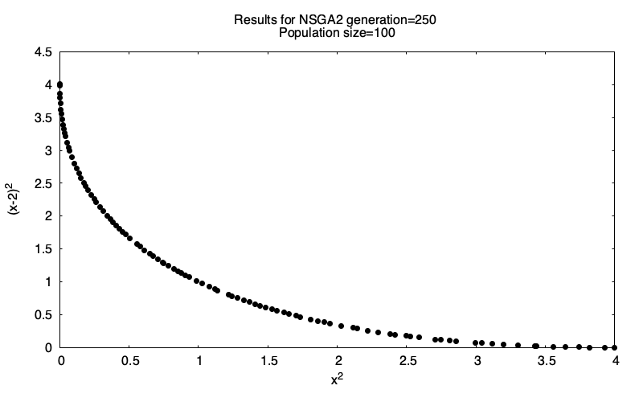
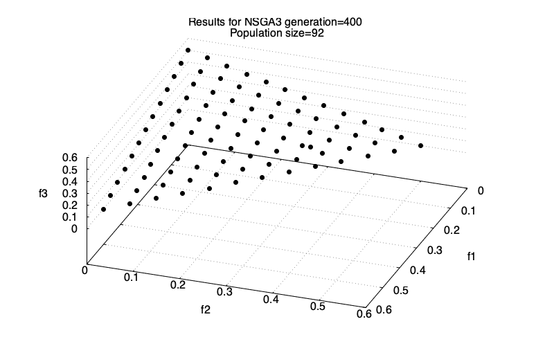
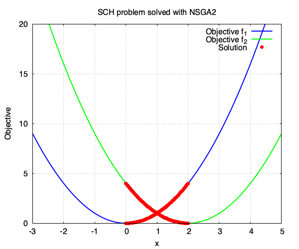

# NSGA RS

[](https://crates.io/crates/nsga_rs)
[](https://docs.rs/nsga_rs)
[](LICENSE.txt)

**NSGA RS** is a Rust framework for solving multi-objective optimisation problems using the
NSGA family of multi-objective evolutionary algorithms (MOEAs). It gives you fast, parallel, and fully serialisable optimisation pipelines — from problem definition through to Pareto-front visualisation.

|                     NSGA2 — 2-objective Schaffer                      |                            NSGA3 — 3-objective DTLZ1                             |
| :-------------------------------------------------------------------: | :------------------------------------------------------------------------------: |
|  |  |

---

## Features

- **Three built-in algorithms** — `NSGA2` ([Deb et al, 2002](https://doi.org/10.1109/4235.996017)), `NSGA3` ([Deb & Jain, 2014](https://10.1109/TEVC.2013.2281535)), and `AdaptiveNSGA3` ([Jain et al, 2014](doi.org/10.1109/TEVC.2013.2281534))
- **Flexible problem definition** — minimise or maximise any number of objectives; constrained or unconstrained
- **Rich variable types** — real, integer, boolean, and categorical (choice) variables, each with optional bounds
- **Parallel evaluation** — multi-threaded objective and constraint evaluation via Rayon
- **Resumable runs** — export the full population history as JSON and resume from any checkpoint
- **Python bindings** — exposes a PyO3 interface so you can wrap the library in your own Python package
- **Hypervolume metric** — calculate hypervolume directly from individuals, values, or serialised JSON files
- **Flexible stopping conditions** — stop by generation count, function evaluations, elapsed time, or combinations using `Any` / `All`

---

## Installation

Add the crate to your `Cargo.toml`:

```toml
[dependencies]
nsga_rs = "*"
```

---

## Quick Start

The example below solves Schaffer's problem, a classic 2-objective test, using `NSGA2`.

### 1. Define the problem

The problem aims to minimise the following 2 objectives:

- f<sub>1</sub>(x) = x<sup>2</sup>
- f<sub>2</sub>(x) = (x - 2)<sup>2</sup>

The problem has 1 variable (`x`) bounded to `-1000` and `1000`. The optional solution is expected
to lie in the `[0; 2]` range.

### 2. Problem implementation

The problem is implemented below using the `SCHProblem` struct. When an algorithm runs,
it first generates a set of potential solutions for the problem variables (in this case `x`). It
then calculates the objectives (f<sub>1</sub>(x) and f<sub>2</sub>(x)) in the `Evaluator`
trait exposed by this library.

```rust
#[derive(Debug)]
pub struct SCHProblem;

impl SCHProblem {
    /// Create the problem for the optimisation.
    pub fn create() -> Result<Problem, OError> {
        // define the objectives
        let objectives = vec![
            Objective::new("x^2", ObjectiveDirection::Minimise),
            Objective::new("(x-2)^2", ObjectiveDirection::Minimise),
        ];
        // define the variable
        let variables = vec![VariableType::Real(BoundedNumber::new(
            "x", -1000.0, 1000.0,
        )?)];
        // the problem has no constraints
        let constraints = None;

        let e = Box::new(SCHProblem);
        Problem::new(objectives, variables, constraints, e)
    }

    /// The first objective function
    pub fn f1(x: f64) -> f64 {
        x.powi(2)
    }

    /// The second objective function
    pub fn f2(x: f64) -> f64 {
        (x - 2.0).powi(2)
    }
}

// Implement the function to evaluate the objectives and constraints. The `evaluate`
// function below receives the individuals which contain the variables/solutions `x` 
// proposed by the algorithm. The function must return the evaluated objectives and
// constraints in the `EvaluationResult` struct.
impl Evaluator for SCHProblem {
    fn evaluate(&self, i: &Individual) -> Result<EvaluationResult, Box<dyn Error>> {
        let x = i.get_variable_value("x")?.as_real()?;
        let mut objectives = HashMap::new();
        objectives.insert("x^2".to_string(), SCHProblem::f1(x));
        objectives.insert("(x-2)^2".to_string(), SCHProblem::f2(x));
        Ok(EvaluationResult {
            constraints: None,
            objectives,
        })
    }
}
```

### 2. Configure and run the algorithm

The code below set up the `NSGA2` algorithm with `100` individuals and will
stop when `250` population generations are reached.

```rust
...

fn main() -> Result<(), Box<dyn std::error::Error>> {
    // Setup the NSGA2 algorithm
    let args = NSGA2Arg {
        // use 100 individuals and stop the algorithm at 250 generations
        number_of_individuals: 100,
        stopping_condition: StoppingConditionType::MaxGeneration(MaxGeneration(250)),
        // use default options for the SBX and PM operators
        crossover_operator_options: None,
        mutation_operator_options: None,
        // no need to evaluate the objective in parallel
        threads: NumThreads::None,
        // do not export intermediate solutions
        export_history: None,
        resume_from_file: None,
        // to reproduce results
        seed: Some(10),
    };
    let mut algo = NSGA2::new(problem, args)?;
    // run the algorithm
    algo.run()?;

    // Export the final population to JSON
    algo.save_to_json(&PathBuf::from("."), Some("SCH_2obj"))?;
    Ok(())
}
```

Run it with:

```sh
cargo run --example nsga2_sch --release
```

The algorithm exports a JSON file (e.g. `SCH_2obj_NSGA2_gen250.json`) containing the full population.



All examples live in the [`examples/`](examples/) folder and can be run with `cargo run --example <name> --release`.

## Algorithms

| Algorithm       | Description                                                                                                 |
| --------------- | ----------------------------------------------------------------------------------------------------------- |
| `NSGA2`         | Non-dominated Sorting Genetic Algorithm II — fast, crowding-distance-based ranking                          |
| `NSGA3`         | Reference-point-based NSGA for many-objective problems                                                      |
| `AdaptiveNSGA3` | Adaptive variant (Jain & Deb, 2014) for problems where not all reference points intersect the optimal front |

Full API documentation is on [docs.rs](https://docs.rs/optirustic/).

## Stopping Conditions

Runs can be stopped by:

- **`MaxGeneration`** — a fixed number of generations
- **`MaxFunctionEvaluations`** — a total number of objective evaluations
- **`Elapsed`** — a wall-clock duration
- **`Any` / `All`** — combine multiple conditions with OR / AND logic

## Exporting & Resuming

Set `export_history` in the algorithm args to write JSON snapshots at regular intervals, or call `save_to_json` once at the end. To resume from a checkpoint, pass the snapshot path via `resume_from_file`.

### Plotting and inspecting data

With the library, you can:

- plot the Pareto front chart for problems with 2 or 3 objectives from the exported data. Check out the [SCH solved with NSGA2](examples/nsga2_sch.rs) or [DTLZ1 solved with NSGA3](examples/nsga2_dtlz1.rs) or [inverted DTLZ1 solved with Adaptive NSGA3](examples/adaptive_nsga3_inverted_dtlz1).
- plot the hyper-volume metric to track convergence using `Hypervolume::plot_from_files`. Check out the [convergence example](examples/convergence.rs).

## Python Bindings

The library includes a [PyO3](https://pyo3.rs/) interface, so you can bundle it into your own Python package using [Maturin](https://www.maturin.rs/). There is no pre-built package on PyPI, the bindings are provided as a starting point for you to build and distribute as needed.

## License

This project is licensed under the [MIT License](LICENSE.txt).
